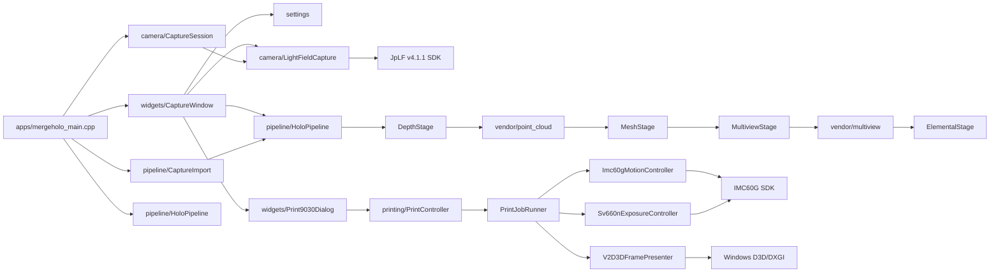
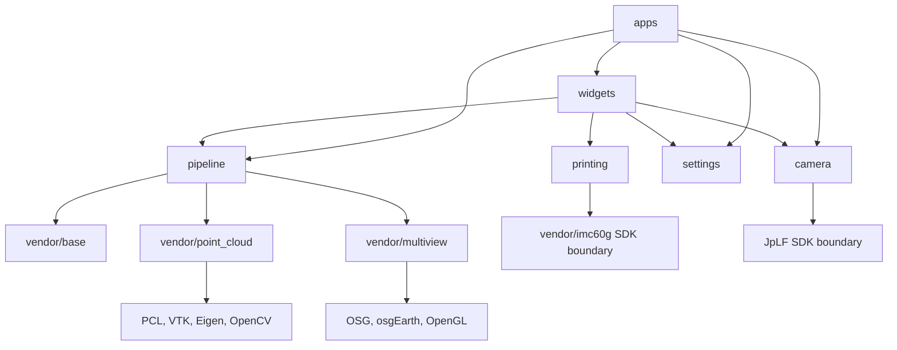

# MergeHolo Project Code Index

This is the maintained-source navigation map for MergeHolo. It records project
ownership and direct source-level relationships; it is not generated API
reference documentation.

## How To Read And Maintain This Index

Start with the runtime graph for an end-to-end request, then open the matching
module section. Each type card has this form:

```text
Source: defining file(s)
Role: one responsibility in the system
Depends on: direct project dependencies; external boundaries in brackets
Used by: project callers or owning flow
Boundary: persistent state, input, output, or lifecycle owned by the type
```

Scope includes maintained source under `apps`, `camera`, `pipeline`,
`printing`, `settings`, `widgets`, `vendor/base`, `vendor/point_cloud`, and
`vendor/multiview`. Qt, OpenCV, PCL, OSG, CUDA, JpLF v4.1.1, and IMC60G are
external boundaries: their project-side adapters and configuration points are
indexed, their internal implementation is not.

Update this file when `mergeholo.pro`, `pipeline/PipelineModule.pri`, a public
project type, a module boundary, or an SDK adapter changes. Paired `.cpp`
files are covered by their corresponding header card unless a file implements a
coherent free-function module.

## Build Ownership And External Boundaries

`mergeholo.pro` is the top-level qmake manifest. It defines the `mergeholo`
Qt Widgets executable, owns application/camera/printing/settings/widgets and
maintained vendor source lists, and includes the shared build fragments.
`pipeline/PipelineModule.pri` owns the pipeline source and header lists.

| Build owner | Responsibility | Key boundary |
| --- | --- | --- |
| `Pri/common.pri` | C++ source encoding, MSVC v142 guard, qmake intermediate directories, output path | Deploys the executable to `00-bin/`; intermediates go to `FF-tmp/`. |
| `Pri/imc60g.pri` | IMC60G include, import library, runtime presence checks | `vendor/imc60g` SDK, x64 only. |
| `Pri/opencv.pri` | OpenCV headers and Release/Debug link selection | OpenCV 4.5.0, discovered through `OPENCV_ROOT`. |
| `Pri/holo_pipeline.pri` | PCL, Boost, OSG, osgEarth, OpenNI2, VTK, Qhull linkage | MSVC v142 x64 paths and `/arch:AVX`. |
| `Pri/cuda.pri` | Optional CUDA include/link setup | Builds with `no_cuda` if the toolkit is absent. |
| `Pri/ffmpeg.pri` | Retained FFmpeg include/link fragment | Local FFmpeg installation; not currently included by `mergeholo.pro`. |
| `Pri/eigen5.pri` | Retained Eigen include fragment | Header-only Eigen installation; not currently included by `mergeholo.pro`. |
| `mergeholo.pro` | Qt modules, JpLF SDK lookup, Win32 D3D linkage | Requires `JP_LF_V4_ROOT` or the sibling `holocamera` SDK path. |

The compilation manifest is authoritative for active production source. Some
retained headers outside its explicit lists are documented below because they
are project-owned compatibility/support code.

## Runtime And Data Flow

The default interactive flow is:

```text
CaptureWindow
  -> LightFieldCapture live RGB/depth frames
  -> frozen capture confirmation
  -> CaptureImport RGB + TIFF input pair
  -> HoloPipeline depth -> mesh -> multiview -> elemental
  -> optional persisted result and printing selection
```

The CLI entry also supports capture-only, import-only, and pipeline-only modes.
The detailed runtime graph is in the maintained vendor section after all module
arrows are established from source.

## Module Dependency Map

The detailed module graph is maintained with the runtime graph near the end of
this index. Its arrows point from caller to direct project dependency; external
libraries are grouped as boundary nodes.

## Directory And File Roles

| Path | Identity | Notes |
| --- | --- | --- |
| `apps/` | executable entry | Command dispatch and application bootstrap. |
| `camera/` | capture integration | Light-field capture, frame orientation, session control, and retained camera support headers. |
| `config/` | versioned runtime configuration | Default processing, camera, mesh, and printing profiles. |
| `docs/` | project knowledge | Operator guides, design/plan records, and this index. |
| `pipeline/` | processing domain | Capture input, five processing stages, in-memory results, persistence, and timing. |
| `Pri/` | qmake build fragments | Compiler settings, output locations, and external libraries. |
| `printing/` | 9030 print domain | Job control, screen presentation, exposure timing, motion, and SDK adapters. |
| `scripts/` | build and test entry points | PowerShell wrappers around qmake, tests, and hardware acceptance. |
| `settings/` | persisted UI configuration | Key/value INI access and unified processing settings. |
| `ui/` | Qt Designer forms | Layouts owned by the widgets module. |
| `vendor/base/` | maintained base utilities | File and logging helpers compiled into the application. |
| `vendor/multiview/` | maintained rendering module | OSG render planning, atlas creation, camera motion, and memory sinks. |
| `vendor/point_cloud/` | maintained geometry module | Depth-to-point-cloud, mesh reconstruction, and texturing adapters. |
| `vendor/imc60g/` | binary SDK dependency | Header, import library, and runtime DLL; no project logic belongs here. |
| `00-bin/` | deployed runtime output | Ignored build/deployment output, not source. |
| `FF-tmp/` | qmake intermediate output | Ignored `moc`, `uic`, object, and test build artifacts. |
| `build/`, `debug/`, `release/` | local build products | Ignored build state. |
| `output/`, `runs/` | runtime output | Ignored processing, capture, log, and acceptance data. |
| `samples/` | optional input data | Ignored demo or local validation inputs. |
| `.qmake.stash`, `Makefile*`, `*.obj` | generated local state | Regenerated by qmake/nmake and ignored. |

## Application, UI, Settings, And Camera

### Entry And UI

#### `main` (module)

Source: `apps/mergeholo_main.cpp`.

Role: creates `QApplication`, applies native Windows styling, writes IMC60G
startup diagnostics, finds project-relative defaults, and dispatches UI or CLI
modes.

Depends on: `CaptureWindow`, `CaptureSession`, `CaptureImport`,
`runHoloPipelineCli`, `ProcessingSettingsStore`, `PrintHardwareProfile`, and
`NativeUiStyle`.

Used by: the operating system process entry point.

Boundary: `--ui` is the default; `--capture`, `--import-capture`, and
`--capture-and-run` own capture/import flow; `--pipeline` and bare
`--config` forward to the pipeline CLI. It appends startup diagnostics to
`runs/latest/imc60g_startup.log` without opening motion hardware.

#### `CaptureWindow`

Source: `widgets/CaptureWindow.h`, `widgets/CaptureWindow.cpp`,
`ui/CaptureWindow.ui`.

Role: primary Qt main window and state machine for live preview, frame freeze,
pipeline launch, settings, result-save warnings, and opening the print dialog.

Depends on: `LightFieldCapture`, `ProcessingSettings` and its store,
`CaptureOrientation`, `PipelineInput`, `HoloPipeline`, `DepthMeshModelMemory`,
`ElementalMemoryResult`, `ProcessingSettingsDialog`, and `Print9030Dialog`.

Used by: `main` in default `--ui` mode.

Boundary: owns the camera object, RGB/depth OpenCV matrices, preview images,
the `Starting -> Live -> Frozen -> Processing -> Done/Error` state, a pipeline
worker `QThread`, and the shared elemental memory result passed to printing.

#### `InputSettingsDialog`

Source: `widgets/InputSettingsDialog.h`, `widgets/InputSettingsDialog.cpp`,
`ui/InputSettingsDialog.ui`.

Role: selects or clears a directory-based `PipelineInputSelection` for RGB/
depth, mesh, or multiview input modes.

Depends on: `PipelineInput` and Qt dialog/file-picker controls.

Used by: `ProcessingSettingsDialog` and save-settings dialog tests.

Boundary: holds a draft selection only; accept/reject/close either returns it
or clears it.

#### `ProcessingSettingsDialog`

Source: `widgets/ProcessingSettingsDialog.h`,
`widgets/ProcessingSettingsDialog.cpp`, `ui/ProcessingSettingsDialog.ui`.

Role: edits the unified processing, camera, point-cloud, mesh, and output
settings through common, imaging, advanced, and device pages.

Depends on: `ProcessingSettings`, dynamically created `InputSettingsDialog`
and `SaveSettingsDialog`, and Qt controls.

Used by: `CaptureWindow`.

Boundary: retains a draft `ProcessingSettings`; emits `printRequested`,
`cameraTestRequested`, and `cameraReinitializeRequested` for the owning window
to execute hardware-affecting work.

#### `SaveSettingsDialog`

Source: `widgets/SaveSettingsDialog.h`, `widgets/SaveSettingsDialog.cpp`,
`ui/SaveSettingsDialog.ui`.

Role: edits or clears `ResultSaveSettings` independently of the broader
processing dialog.

Depends on: `ResultSaveSettings` and Qt dialog controls.

Used by: `ProcessingSettingsDialog` and dialog tests.

Boundary: deliberately clears its result on reject or close, preventing a
cancelled configuration from being persisted.

#### `Print9030Dialog`

Source: `widgets/Print9030Dialog.h`, `widgets/Print9030Dialog.cpp`,
`ui/Print9030Dialog.ui`.

Role: print-operator UI for IMC60G connection/homing, jogging, origin,
source selection, preview, job start/pause/resume/cancel, and safe close.

Depends on: `Print9030Config`, `PrintImageSource`, `ElementalMemoryResult`,
and the `IPrintController` interface.

Used by: `CaptureWindow`; directly tested through a recording controller.

Boundary: owns UI configuration and two image-set sources. Folder loading runs
asynchronously through `QFutureWatcher`; controller state/signals drive the UI
and are not duplicated in the dialog.

#### `NativeUiStyle` (module)

Source: `widgets/NativeUiStyle.h`, `widgets/NativeUiStyle.cpp`.

Role: applies shared native Windows Qt appearance to `QApplication`.

Depends on: Qt only.

Used by: `main` before any UI is shown; dialog tests exercise it.

Boundary: process-wide visual configuration, no domain state.

### Settings Model And Persistence

#### `KeyValueConfig`

Source: `settings/KeyValueConfig.h`, `settings/KeyValueConfig.cpp`.

Role: line-preserving key/value INI reader and writer.

Depends on: Qt string/container types.

Used by: `ProcessingSettingsStore`.

Boundary: retains original lines, key-to-line index, trailing-newline state,
and a single file path so unknown keys/comments survive a save.

#### `CameraCaptureSettings`

Source: `settings/ProcessingSettings.h`.

Role: camera SDK input values, parse-config location, missed-frame threshold,
and capture orientation.

Depends on: `CaptureRotation` and Qt strings.

Used by: `ProcessingSettings`, `CaptureSessionOptions`, `CaptureWindow`, and
`makeCameraInput`.

Boundary: translates persisted UI fields to `LightFieldCapture::HoloInData`.

#### `PipelineUiSettings`

Source: `settings/ProcessingSettings.h`.

Role: UI-owned pipeline dimensions, subject pose, flip flags, atlas size, and
elemental writer settings.

Depends on: Qt strings and scalar values.

Used by: `ProcessingSettings`, `ProcessingSettingsDialog`, and pipeline-config
generation in `CaptureWindow`.

Boundary: becomes values in the runtime pipeline INI.

#### `PointCloudUiSettings` and `MeshUiSettings`

Source: `settings/ProcessingSettings.h`.

Role: UI-owned point-cloud filtering/depth parameters and mesh reconstruction/
texturing parameters.

Depends on: scalar values only.

Used by: `ProcessingSettings`, `ProcessingSettingsDialog`, and
`ProcessingSettingsStore`.

Boundary: become values in `depth_to_pointcloud_config.cfg` and
`mesh_config.cfg`.

#### `ProcessingSettings`

Source: `settings/ProcessingSettings.h`.

Role: aggregate root for selected input, result persistence, pipeline,
point-cloud, mesh, and camera settings.

Depends on: `PipelineInputSelection`, `ResultSaveSettings`, and the four UI
settings structures above.

Used by: `CaptureWindow`, settings dialogs, CLI capture option construction,
and `ProcessingSettingsStore`.

Boundary: in-memory UI model; it does not itself read or write files.

#### `defaultProcessingSettings`, validation, and conversion helpers (module)

Source: `settings/ProcessingSettings.h`, `settings/ProcessingSettings.cpp`.

Role: constructs defaults, converts subject-size and distance-scale values,
calculates view/elemental counts, validates settings, and creates
`LightFieldCapture::HoloInData`.

Depends on: `ProcessingSettings`, `CaptureRotation`, `PipelineInput`,
`ResultSaveSettings`, and `LightFieldCapture`.

Used by: `main`, `CaptureWindow`, and settings tests.

Boundary: pure model translation/validation apart from the project-root inputs
used for defaults.

#### `ProcessingSettingsPaths`

Source: `settings/ProcessingSettingsStore.h`,
`settings/ProcessingSettingsStore.cpp`.

Role: names the project-root-derived pipeline, point-cloud, mesh, and camera
configuration paths.

Depends on: Qt strings.

Used by: `main`, `CaptureWindow`, and `ProcessingSettingsStore` free functions.

Boundary: maps one project root to versioned configuration file locations.

#### `loadProcessingSettings` and `saveProcessingSettings` (module)

Source: `settings/ProcessingSettingsStore.h`,
`settings/ProcessingSettingsStore.cpp`.

Role: loads/saves the unified model across multiple INI/CFG files using
`KeyValueConfig`.

Depends on: `ProcessingSettingsPaths`, `ProcessingSettings`, and
`KeyValueConfig`.

Used by: `main` and `CaptureWindow`.

Boundary: reports failure through optional error strings and is the only
settings-layer file I/O coordinator.

### Camera Capture And Project-Side SDK ABI

#### `CaptureRotation` and orientation functions (module)

Source: `camera/CaptureOrientation.h`, `camera/CaptureOrientation.cpp`.

Role: parses/names clockwise or counter-clockwise capture orientation and
rotates RGB or spatial-depth matrices while preserving depth-axis semantics.

Depends on: OpenCV.

Used by: `CaptureWindow`, `CaptureSession`, `ProcessingSettings`, and
`camera/tests/test_capture_orientation.cpp`.

Boundary: input/output are `cv::Mat`; no camera or persistence state.

#### `CaptureSessionOptions` and `runCaptureSession` (module)

Source: `camera/CaptureSession.h`, `camera/CaptureSession.cpp`.

Role: implements CLI capture-only operation: initializes the camera, previews
as requested, detects scene changes, applies orientation, and writes captured
RGB/TIFF/raw data.

Depends on: `CameraCaptureSettings`, `LightFieldCapture`, `CaptureRotation`,
and `FrameChangeDetector`.

Used by: `main` for `--capture` and `--capture-and-run`.

Boundary: `CaptureSessionOptions.saveRoot` owns `2d`, `3d`, and `raw` output;
runtime stops on duration, frame count, user interrupt, camera error, or low
free disk space.

#### `LightFieldCapture`

Source: `camera/LightFieldCapture.h`, `camera/LightFieldCapture.cpp`.

Role: project adapter for the JpLF camera and parser SDK. It initializes SDK
objects, captures raw frames on a worker thread, parses them to OpenCV images,
and supplies queued `HoloOutData` frames.

Depends on: `JP::IDeviceInterface`, `JP::threadsafe_queue`, `JpICamera`,
`JpIParse`, OpenCV, standard threading, and the JpLF v4.1.1 binary SDK.

Used by: `CaptureWindow`, `CaptureSession`, and settings conversion helpers.

Boundary: `HoloInData` is camera/parser configuration; `HoloOutData` exposes
2D image, 3D image, depth map, raw frame, timestamp, and temperatures. The
class owns SDK pointers, parser buffers, capture thread, error state, and the
bounded frame queue; `release` joins/releases them.

#### `JpICamera`, `strCameraConf`, and `strCameraData`

Source: `camera/JpICamera.h`.

Role: project-side declaration of the camera factory and virtual ABI used by
the JpLF SDK.

Depends on: the JpLF v4.1.1 import library/runtime.

Used by: `LightFieldCapture` only.

Boundary: the SDK creates/releases the interface and provides initialization,
capture, free, and exposure operations; this repository does not implement
the interface.

#### `JpIParse`, `strLightFieldInput`, and `strLightFieldOutput`

Source: `camera/JpIParse.h`.

Role: project-side declaration of the JpLF parser factory and input/output ABI.

Depends on: the JpLF v4.1.1 import library/runtime.

Used by: `LightFieldCapture` only.

Boundary: SDK allocation and parse buffers cross this interface; the adapter
copies parsed data into owned OpenCV matrices before queueing it.

#### `FrameChangeDetector` (header-only module)

Source: `camera/FrameChangeDetector.hpp`.

Role: compares frames with grayscale difference, blur, threshold, morphology,
and contour area to decide whether capture output should be saved.

Depends on: OpenCV and standard-library time/file utilities.

Used by: `CaptureSession`.

Boundary: `hasSignificantChange` is the production predicate; optional helper
functions open a debug view or write `comparison_results/` and are not part of
the normal UI capture flow.

#### `JP::IDeviceInterface`

Source: `camera/CommonFiles/JPDeviceInterface.h`.

Role: generic device lifecycle/read/write interface inherited by
`LightFieldCapture`.

Depends on: standard smart pointers.

Used by: `LightFieldCapture`.

Boundary: abstract initialization, release, open/close, and byte I/O contract.

#### `JP::threadsafe_queue<T>`

Source: `camera/CommonFiles/threadsafe_queue.hpp`.

Role: bounded, condition-variable-based frame handoff queue.

Depends on: standard mutex, queue, and condition variable primitives.

Used by: `LightFieldCapture` for `HoloOutData` handoff between capture worker
and UI/CLI consumer.

Boundary: drops oldest entries at capacity and offers timed `pop`.

### Retained `camera/CommonFiles` Compatibility Headers

These headers were carried from the camera predecessor. `JPDeviceInterface.h`
and `threadsafe_queue.hpp` above are direct dependencies of active production
source. The rows below are retained project files but have no direct include
from the active `mergeholo.pro` production path; treat them as compatibility
inventory until a caller is added or they are deliberately retired.

| Source | Type or module entries | Role and direct project dependency |
| --- | --- | --- |
| `camera/CommonFiles/CommonAlgorithm.hpp` | `CCommonAlgorithm`, `Algo` | Header-only generic algorithm/container helpers; base for `CCommonString`. |
| `camera/CommonFiles/CommonMacro.h` | `MessageBoxType`, `QThreadPtr`, macros | Qt/message/logging compatibility macros; references unavailable legacy dialog/logger headers. |
| `camera/CommonFiles/CommonOpencvOperate.hpp` | free-function module | OpenCV convenience operations; external OpenCV boundary. |
| `camera/CommonFiles/CommonString.hpp` | `CCommonString` | String/file conversion helpers built on `CCommonAlgorithm`. |
| `camera/CommonFiles/DataQueue.hpp` | `CDataQueue<T>` | Legacy queue wrapper built on `threadsafe_queue`. |
| `camera/CommonFiles/dataStructure.h` | `H264Frame`, `stHeadElement`, `stH264Head`, `stAudioData` | H.264/audio packet structures. |
| `camera/CommonFiles/FFMpegOpt.hpp` | `CFFMpeg264Opt`, `FrameTail` | H.264 encode/decode helper; depends on retained FFmpeg compatibility layer. |
| `camera/CommonFiles/GpsAlgorithm.hpp` | `SaveGpsOpt` | GPS record helper namespace/module. |
| `camera/CommonFiles/JpCameraInterface.h` | `IJpCameraInterface`, `camera_op_traits`, `_struct_camera_frame` | Generic OpenCV camera-frame interface. |
| `camera/CommonFiles/JpCameraMgr.hpp` | `CJpCameraMgrInterface<CNT>`, `CJpCameraMgr<CNT>` | Legacy camera manager; depends on missing predecessor `AppConfig`/database headers. |
| `camera/CommonFiles/JPColorTable.hpp` | `CColorTable` | Image color-table helper. |
| `camera/CommonFiles/JpCTime.hpp` | `period_traits`, `CJpCTime<T>`, `CJpCTimeMs`, `CJpCTimeUs`, `CJpCTimeSecond`, `JpCtime` | Clock, period, timeout, and formatting helpers. |
| `camera/CommonFiles/JpFFMpegDecoder.hpp` | `JpFFMpegDecoder`, `DecodeContext` | FFmpeg decoder adapter; depends on a predecessor decoder interface not present here. |
| `camera/CommonFiles/NewTec.hpp` | `nonesuch`, `detector`, `is_detected`, `detected_t`, `is_template_of`, `is_all_of`, `is_one_of` | C++ detection-idiom templates and member-detection macros. |
| `camera/CommonFiles/PointcloudFunction.hpp`, `camera/CommonFiles/PointcloudOperate.hpp` | free-function modules | Legacy PCL registration and point-cloud convenience functions. |
| `camera/CommonFiles/PrjSetting.hpp` | `CInfoMgrBase`, `CSettingInfo` | Legacy project-settings manager. |
| `camera/CommonFiles/QImageCVMat.hpp` | conversion module | Qt `QImage` and OpenCV `cv::Mat` conversion helpers. |
| `camera/CommonFiles/RigidTrans3D.hpp` | `TRigidTrans3D` | Rigid 3D transform structure. |
| `camera/CommonFiles/Setting.hpp` | `CInfoMgrBase`, `CSettingInfo` | Alternate legacy settings manager using `Singleton`; overlaps `PrjSetting.hpp`. |
| `camera/CommonFiles/Singleton.hpp` | `Singleton<T>` | Header-only singleton wrapper. |
| `camera/CommonFiles/StructDef.h` | `stCameraParam`, `stSteoroParam`, `stDispalyCard`, `stRGBD` | Camera/stereo/display/RGBD parameter structures. |
| `camera/CommonFiles/DatabaseInterface/DbCommonHeader.h` | aggregation module | Shared database include/namespace setup. |
| `camera/CommonFiles/DatabaseInterface/DbInterface.hpp` | `CDbInterface` | Abstract SQL/database interface for entity access. |
| `camera/CommonFiles/DatabaseInterface/DbLogicBase.hpp` | `CDbLogicBase` | Templated database business-logic base over `CDbInterface`. |
| `camera/CommonFiles/DatabaseInterface/EntityBase.hpp` | `CEntityBase` | Base entity mapping/serialization contract. |
| `camera/CommonFiles/DatabaseInterface/RecordsetMgr.hpp` | `CRecordsetMgr` | Database result-set manager. |
| `camera/CommonFiles/DbMgr.hpp` | `CDbMgr<T>` | Database manager wrapper used by the Qt database adapter. |
| `camera/CommonFiles/DbEntity/EntityCalibSetting.hpp` | `CEntityCalibSetting` | Calibration-settings entity derived from `CEntityBase`. |
| `camera/CommonFiles/DbEntity/EntityExtrinsic.hpp` | `CEntityExtrinsic` | Extrinsic-calibration entity derived from `CEntityBase`. |
| `camera/CommonFiles/DbEntity/EntityIntrinsic.hpp` | `CEntityIntrinsic` | Intrinsic-calibration entity derived from `CEntityBase`. |
| `camera/CommonFiles/DbEntity/EntityUser.hpp` | `CEntityUser` | User entity derived from `CEntityBase`. |
| `camera/CommonFiles/DbEntity/DatabaseEntityHeader.h` | aggregation module | Includes calibration/user entity declarations. |
| `camera/CommonFiles/DbEntity/EntityImpl/EntityCamera.hpp` | `CEntityCamera` | Camera entity derived from `CEntityBase`. |
| `camera/CommonFiles/DbEntity/EntityImpl/EntityCameraGroup.hpp` | `CEntityCameraGroup` | Camera-group entity derived from `CEntityBase`. |
| `camera/CommonFiles/DbEntity/EntityImpl/EntityCommon.hpp` | `CEntityCommon` | Common-key/value entity derived from `CEntityBase`. |
| `camera/CommonFiles/DbEntity/EntityImpl/EntityImage.hpp` | `CEntityImage` | Image entity derived from `CEntityBase`. |
| `camera/CommonFiles/DbEntity/EntityImpl/EntityRtMatrix.hpp` | `CEntityRtMatrix` | Rigid-transform matrix entity derived from `CEntityBase`. |
| `camera/CommonFiles/DbEntity/EntityImpl/Entitysqlitesequence.hpp` | `CEntitysqlitesequence` | SQLite sequence entity derived from `CEntityBase`. |
| `camera/CommonFiles/QtCommon/CommonQtCtrlOperate.hpp` | `CCommonQtCtrlOperate`, `CQtCtrlOpt` | Qt widget-control convenience operations. |
| `camera/CommonFiles/QtCommon/QtDbMgr.hpp` | `CQtDbMgr` | Qt-specialized database manager over `CDbMgr<CDbLogic>`. |
| `camera/CommonFiles/QtCommon/qtfileoperate.hpp` | `CQtFileOperate` | Qt file-system utility wrapper. |
| `camera/CommonFiles/QtCommon/qtstring.hpp` | `CQtString` | Qt string helper built on `CCommonString`. |
| `camera/CommonFiles/QtCommon/SettingMgr.hpp` | `CSettingMgr` | Legacy Qt settings manager. |
| `camera/CommonFiles/QtCommon/TabManager.hpp` | `CMainpageManager<T>`, `CButtonMenuManager`, `CTabManager` | Qt page/button/tab navigation managers. |
| `camera/CommonFiles/QtCommon/TimeOut.hpp` | `CTimeout`, `CWaitCondition<T>`, `COnlyWait`, `CWait30S`, `CWait10S`, `CWaitForever`, `CWaitNone` | Compile-time timeout/wait helpers. |

## Pipeline

### Pipeline Entry, Configuration, And Input

#### `runHoloPipelineCli` and `runHoloPipelineCliWithResult` (module)

Source: `pipeline/HoloPipeline.h`, `pipeline/HoloPipeline.cpp`.

Role: CLI boundary and five-stage orchestrator.

Depends on: config parsing, all `pipeline/stages` modules, input resolution,
timing/logging, in-memory result types, and result persistence.

Used by: `main` CLI paths and `CaptureWindow` worker thread.

Boundary: parses a `HoloConfig`/`CliOptions`, returns an integer exit code,
and optionally writes `ElementalMemoryResult` and `ResultSaveReport` for the
UI. It owns stage order and clears intermediate PCL memory when no longer
needed.

#### `HoloConfig`, `CliOptions`, and `StageTiming`

Source: `pipeline/PipelineContext.h`.

Role: the pipeline's central configuration, command-line selection, and
per-stage timing records.

Depends on: `PipelineInputMode`, `ResultSaveSettings`,
`ModelMoveCameraConfig`, `MultiviewMemoryResult`, and `ElementalMemoryResult`.

Used by: config parser, all stages, logger, persistence, and pipeline entry.

Boundary: `HoloConfig` owns resolved paths, stage switches, dimensions, camera
pose, output policy, and timestamp; it is mutable where multiview resolves
derived values.

#### `applyConfig`, `parseCli`, and `printUsage` (module)

Source: `pipeline/PipelineConfig.h`, `pipeline/PipelineConfig.cpp`.

Role: loads the pipeline INI into `HoloConfig`, parses stage/input/dry-run
arguments, and prints CLI help.

Depends on: `PipelineContext` and filesystem/standard parsing.

Used by: `runHoloPipelineCliWithResult`.

Boundary: converts user text and paths to the typed context; it does not run
processing stages.

#### `CaptureImportOptions` and `importCaptureForPipeline` (module)

Source: `pipeline/CaptureImport.h`, `pipeline/CaptureImport.cpp`.

Role: normalizes capture-session output into same-stem JPG/TIFF pipeline pairs.

Depends on: Qt filesystem/string utilities.

Used by: `main --import-capture` and `--capture-and-run`.

Boundary: copies from `captureRoot/2d` and `captureRoot/3d` to
`pipelineInputDir`; overwrite policy is explicit in the options.

#### `PipelineInputMode`, `PipelineInputSelection`, `MultiviewInputSpec`,
`PipelineInputFiles`, and `PipelineRunPlan`

Source: `pipeline/PipelineInput.h`, `pipeline/PipelineInput.cpp`.

Role: models camera, RGB/depth, mesh, or multiview external input and derives
which stages must run for that mode.

Depends on: filesystem paths and `MeshMemoryResult` for mesh preload.

Used by: `ProcessingSettings`, `InputSettingsDialog`, `CaptureWindow`,
`HoloConfig`, and `HoloPipeline`.

Boundary: resolves selected input to concrete paths without mutating source
data; `loadPipelineMeshInput` only materializes an external mesh in memory.

#### `DepthMemoryResult` and `MeshMemoryResult`

Source: `pipeline/DepthMeshModelMemory.h`.

Role: ownership-safe in-memory handoff objects for the PCL point cloud and
polygon mesh.

Depends on: PCL `PointXYZRGB`/`PolygonMesh` and filesystem paths.

Used by: depth, mesh, model, multiview, input preload, persistence, and the
pipeline orchestrator.

Boundary: each records source/output paths plus shared geometry; `clear`
releases PCL data explicitly to bound memory lifetime between stages.

#### `ExternalDepthOrientationResult` and
`normalizeExternalDepthPointCloudAxes` (module)

Source: `pipeline/ExternalDepthOrientation.h`,
`pipeline/ExternalDepthOrientation.cpp`.

Role: correlates depth image axes with reconstructed point-cloud axes and flips
the cloud when an externally supplied RGB/depth input has opposite orientation.

Depends on: OpenCV and PCL.

Used by: `DepthStage` and persistence tests.

Boundary: mutates the supplied PCL cloud only; result diagnostics record
confidence, sample count, correlations, and applied X/Y flips. Its private
`CorrelationAccumulator` is implementation-local.

#### `PipelineTiming` (header/module) and `PipelineLogger` (module)

Source: `pipeline/PipelineTiming.h`, `pipeline/PipelineTiming.cpp`,
`pipeline/PipelineLogger.h`, `pipeline/PipelineLogger.cpp`.

Role: measures/totals stages, formats byte/time values, prints summary output,
and writes the final pipeline log.

Depends on: `StageTiming`, `HoloConfig`, `MultiviewMemoryResult`,
`ElementalMemoryResult`, and `ResultSaveReport`.

Used by: `HoloPipeline` and `ElementalProcessor`.

Boundary: `runTimedStage` only wraps a callable and appends timing records;
`writePipelineLog` is the pipeline-level diagnostic file boundary.

#### `ResultSaveSettings`, `ResultSaveWarning`, and `ResultSaveReport`

Source: `pipeline/ResultSaveSettings.h`.

Role: expresses which memory results should be persisted and records best-effort
save warnings.

Depends on: standard filesystem/string/vector types.

Used by: `ProcessingSettings`, `HoloConfig`, `ResultPersistence`,
`PipelineLogger`, `CaptureWindow`, and `SaveSettingsDialog`.

Boundary: output persistence is optional per mesh/multiview/elemental type;
warnings do not retroactively fail a completed in-memory pipeline result.

#### `ResultPersistence` (module)

Source: `pipeline/ResultPersistence.h`, `pipeline/ResultPersistence.cpp`.

Role: writes timestamped mesh, multiview, and elemental result materializations
from memory.

Depends on: `HoloConfig`, PCL memory results, multiview/elemental memory
results, and `ResultSaveReport`.

Used by: `HoloPipeline` and `PipelineLogger`.

Boundary: each `persist*Result` is `noexcept` and reports individual output
failures as `ResultSaveWarning` rather than invalidating the processing result.

### Stages And In-Memory Data Path

#### `DepthStage` (module)

Source: `pipeline/stages/DepthStage.h`, `pipeline/stages/DepthStage.cpp`.

Role: reads paired RGB/TIFF input and creates a colored PCL point cloud.

Depends on: `HoloConfig`, `CliOptions`, `DepthMemoryResult`,
`depthToPlyColor`, `normalizeExternalDepthPointCloudAxes`, and `FileLibrary`.

Used by: `HoloPipeline`.

Boundary: writes point-cloud output under the configured input/output path and
optionally retains the cloud in `DepthMemoryResult` for mesh reconstruction.

#### `MeshStage` and `runMeshOneStage` (module)

Source: `pipeline/stages/MeshStage.h`, `pipeline/stages/MeshStage.cpp`.

Role: chooses exactly one point-cloud input and reconstructs a PCL polygon mesh.

Depends on: `HoloConfig`, `CliOptions`, `DepthMemoryResult`,
`MeshMemoryResult`, `ConverPointCloud`, and `FileLibrary`.

Used by: `HoloPipeline`.

Boundary: prefers the in-memory depth cloud when available, otherwise resolves
one PLY. It can retain the resulting `pcl::PolygonMesh` for model/multiview
instead of requiring an OBJ round trip.

#### `ModelStage` (module)

Source: `pipeline/stages/ModelStage.h`, `pipeline/stages/ModelStage.cpp`.

Role: produces a textured OBJ/MTL/JPG representation when that stage is
requested.

Depends on: `HoloConfig`, `CliOptions`, `MeshMemoryResult`,
`ConverPointCloud`, and `FileLibrary`.

Used by: `HoloPipeline`.

Boundary: accepts a memory mesh or mesh PLY. In the normal `all` path it is
skipped when multiview will directly consume the memory mesh.

#### `MultiviewStage` (module)

Source: `pipeline/stages/MultiviewStage.h`,
`pipeline/stages/MultiviewStage.cpp`.

Role: builds an OSG scene from memory mesh or model input, creates an atlas
render plan, renders all camera views, and exposes them in memory.

Depends on: `HoloConfig`, `CliOptions`, `MeshMemoryResult`,
`PclMeshOsgBuilder`, `MemoryFrameSink`, `MultiviewAtlasPlan`,
`MultiviewAtlasRenderer`, `MultiviewGraphicsConfig`, `MultiviewRenderPlan`,
`modelMoveHandler`, `PipelineTiming`, and optionally `ElementalAtlasDirectSink`.

Used by: `HoloPipeline`.

Boundary: default output is `MultiviewMemoryResult.sink` plus render plan.
Direct atlas-to-elemental scatter is compiled but supplied only when an
`ElementalMemoryResult*` is non-null; the current orchestrator fixes
`directAtlasElemental` to `false`.

#### `ElementalStage` and `processElemental` (module)

Source: `pipeline/stages/ElementalStage.h`,
`pipeline/stages/ElementalStage.cpp`, `pipeline/elemental/ElementalProcessor.h`,
`pipeline/elemental/ElementalProcessor.cpp`.

Role: transforms multiview frame memory into packed RGB elemental image memory.

Depends on: `HoloConfig`, `CliOptions`, `MultiviewMemoryResult`,
`ElementalMemoryResult`, `ElementalMemoryTransform`, and `PipelineTiming`.

Used by: `HoloPipeline` after multiview; the resulting memory feeds
`CaptureWindow` and `PrintImageSource`.

Boundary: allocates the full elemental byte buffer only after validating
dimensions/size. The private `BoundedIntQueue` supports its worker scheduling
and is not a public component.

### Elemental And Multiview Value Types

#### `ElementalConfig`

Source: `pipeline/elemental/ElementalConfig.h`.

Role: standalone elemental dimensions, JPEG, orientation, and writer-thread
configuration value type.

Depends on: scalar values only.

Used by: retained/experimental elemental code paths; active orchestration
derives equivalent values from `HoloConfig`.

Boundary: no allocation or I/O.

#### `ElementalMemoryMode` and `ElementalMemoryResult`

Source: `pipeline/elemental/ElementalMemoryResult.h`.

Role: owns materialized packed-RGB elemental images and declares whether a
valid result exists.

Depends on: standard owned byte storage.

Used by: pipeline entry/stages, persistence/logger, `CaptureWindow`,
`Print9030Dialog`, and `PrintImageSource`.

Boundary: owns `pixels`, image layout metadata, source orientation flags, and
copy-by-index access; `clear` releases all image memory.

#### `ElementalMemoryTransformConfig`,
`ElementalMemoryTransformStatus`, and transform functions (module)

Source: `pipeline/elemental/ElementalMemoryTransform.h`,
`pipeline/elemental/ElementalMemoryTransform.cpp`.

Role: validates output size, chooses bounded worker count, and performs the
blocked source-frame to elemental-memory transpose.

Depends on: standard threading/size arithmetic and byte buffers.

Used by: `ElementalProcessor`, `ElementalAtlasDirectSink`, and transform tests.

Boundary: caller owns source/output buffers; failures are typed as invalid
argument or size overflow rather than partial result state.

#### `ElementalAtlasDirectSink`

Source: `pipeline/elemental/ElementalAtlasDirectSink.h`,
`pipeline/elemental/ElementalAtlasDirectSink.cpp`.

Role: experimental `MemoryAtlasPageSink` implementation that scatters atlas
page readbacks directly into elemental output memory.

Depends on: `ElementalMemoryResult`, `ElementalMemoryTransformConfig`,
`MemoryAtlasPageSink`, `MultiviewAtlasPlan`, and `MultiviewRenderPlan`.

Used by: `MultiviewStage` only when the disabled direct-atlas path receives a
result pointer.

Boundary: owns one page buffer and scatter timing; it does not own the output
result.

#### `MultiviewConfig` and `MultiviewMemoryResult`

Source: `pipeline/multiview/MultiviewConfig.h`,
`pipeline/multiview/MultiviewMemoryResult.h`.

Role: stores multiview rendering settings and its resulting in-memory frame
sink, render plan, model-build diagnostics, and optional direct-atlas metrics.

Depends on: `ModelMoveCameraConfig`, `MemoryFrameSink`, and
`MultiviewRenderPlan`.

Used by: `HoloConfig`/multiview code and `ElementalProcessor`.

Boundary: `MultiviewMemoryResult` holds shared ownership of sink/plan but not
the originating PCL mesh.

#### `PclMeshOsgBuildResult` and `buildOsgGroupFromPclMesh` (module)

Source: `pipeline/multiview/PclMeshOsgBuilder.h`,
`pipeline/multiview/PclMeshOsgBuilder.cpp`.

Role: converts a PCL polygon mesh to an OSG `Group` and reports accepted/
skipped geometry.

Depends on: PCL and OSG.

Used by: `MultiviewStage` when `MeshMemoryResult` is available.

Boundary: returns OSG-owned scene graph plus diagnostics; it is the explicit
PCL-to-OSG bridge that removes the default OBJ file hop.

## Printing

### Print Configuration And Image Sources

#### `PrintAxisConfig`, `PrintMainConfig`, `Print9030Config`, and config I/O
(module)

Source: `printing/PrintConfig.h`, `printing/PrintConfig.cpp`.

Role: represents per-axis motion parameters and whole-job grid/exposure values;
loads/saves `print_9030.ini`.

Depends on: Qt strings/file I/O.

Used by: `Print9030Dialog`, `PrintController`, timing, preflight, motion, and
printing tests.

Boundary: `Print9030Config` is the UI-to-job configuration aggregate; it does
not contain card-specific axis mapping, which belongs to `PrintHardwareProfile`.

#### `PrintPixelFormat` and `PrintFrame`

Source: `printing/PrintFrame.h`, `printing/PrintFrame.cpp`.

Role: validates one BGR24/BGRA32 image frame for presentation.

Depends on: Qt byte arrays.

Used by: `PrintImageSet`, frame presenters, job runner, and tests.

Boundary: owns packed pixels and geometry/stride metadata for one frame.

#### `PrintImageSourceType`, `PrintImageSet`,
`PrintImageFolderLoadResult`, and image-loading functions (module)

Source: `printing/PrintImageSource.h`, `printing/PrintImageSource.cpp`.

Role: provides immutable indexed print frames from elemental memory, a folder,
or supplied frames; folder loading also infers a grid.

Depends on: `ElementalMemoryResult`, `PrintFrame`, Qt images/filesystem types.

Used by: `Print9030Dialog`, `IPrintController::start`, preflight, job runner,
and print tests.

Boundary: copies or converts source images into owned `QVector<PrintFrame>`;
the private `FolderImageEntry` only assists folder ordering.

#### `PrintHardwareProfile` and profile I/O (module)

Source: `printing/PrintHardwareProfile.h`,
`printing/PrintHardwareProfile.cpp`.

Role: versioned physical IMC card/axis map, homing protocol, pulse geometry,
and SV660N SDO profile.

Depends on: Qt strings/vectors.

Used by: `main` diagnostics, `PrintController`, motion, exposure, timing,
preflight, and hardware tests.

Boundary: loaded from `config/imc60g_print.ini`; it separates physical hardware
truth from user-tunable `Print9030Config`.

### Controller, Job, And Interface Contracts

#### `PrintUiState`, `IPrintController`, and `PrintController`

Source: `printing/PrintController.h`, `printing/PrintController.cpp`.

Role: Qt-facing print state/controller contract and active IMC60G-backed
implementation.

Depends on: `Print9030Config`, `PrintImageSet`, `Imc60gApi`,
`Imc60gMotionController`, `Sv660nExposureController`, `V2D3DFramePresenter`,
`V2PrintTiming`, `PrintHardwarePreflight`, `PrintPositionSampler`, and
`PrintJobRunner`.

Used by: `Print9030Dialog`; tests replace `IPrintController` with recordings.

Boundary: slots enqueue connection, manual motion, origin, and job commands on
its worker thread. Signals are the only state/status/progress/position/hardware
contract visible to the dialog. Private `PrintController::Worker` composes and
owns the active adapters.

#### `PrintJobState` and `PrintJobRunner`

Source: `printing/PrintJobRunner.h`, `printing/PrintJobRunner.cpp`.

Role: executes the V2 row/column print state machine, including preflight,
presentation cadence, scan/step movement, exposure arming, pause/resume,
cancel, and cleanup.

Depends on: `IMotionController`, `IExposureController`,
`IPrintFramePresenter`, `IPrintHardwarePreflight`, and `PrintJobSnapshot`.

Used by: `PrintController::Worker` and print-engine tests.

Boundary: owns the active job snapshot and copied frames; pause/cancel flags
are thread-safe requests, while all SDK calls remain on the runner owner
thread.

#### `PrintMotionReadiness` and `IMotionController`

Source: `printing/IMotionController.h`.

Role: narrow already-connected motion service needed during a print job.

Depends on: `PrintAxisConfig`, Qt numeric/string types, and cancellation atomics.

Used by: `PrintJobRunner` and `PrintHardwarePreflight`; implemented by
`Imc60gMotionController`.

Boundary: intentionally excludes connection/homing/servo/emergency operations;
print phase only begins after readiness proves those conditions.

#### `PrintExposureReadiness` and `IExposureController`

Source: `printing/IExposureController.h`.

Role: abstract position-compare exposure service.

Depends on: Qt numeric/string types.

Used by: `PrintJobRunner` and `PrintHardwarePreflight`; implemented by
`Sv660nExposureController`.

Boundary: arm/disarm uses pulse begin/end values and exposes safe baseline
state.

#### `PrintPresenterReadiness`, `PrintRowVBlankAnchor`, and
`IPrintFramePresenter`

Source: `printing/IPrintFramePresenter.h`.

Role: abstract second-screen preparation, frame display, vblank sequencing,
row anchor, and shutdown service.

Depends on: `PrintFrame` and Qt geometry/string types.

Used by: `PrintJobRunner` and preflight; implemented by `V2D3DFramePresenter`.

Boundary: presentation service owns display lifetime; default methods preserve
a simple present/wait fallback for test doubles.

#### `PreflightFault`, `PrintPreflightResult`, `PrintJobSnapshot`,
`IPrintHardwarePreflight`, and `PrintHardwarePreflight`

Source: `printing/PrintHardwarePreflight.h`,
`printing/PrintHardwarePreflight.cpp`.

Role: validates every hardware, timing, source, second-screen, and vblank
prerequisite before or during a print job.

Depends on: the three print service interfaces, configs/profile, `PrintImageSet`,
and `V2PrintPlan`.

Used by: `PrintJobRunner` and V2 print-engine tests.

Boundary: returns a typed fault/detail rather than issuing motion/exposure
commands itself.

### Active IMC60G, Exposure, Timing, And Presentation Adapters

#### `Imc60gMasterInfo`, `IImc60gApi`, and `Imc60gApi`

Source: `printing/IImc60gApi.h`, `printing/Imc60gApi.h`,
`printing/Imc60gApi.cpp`.

Role: testable, narrow wrapper around the IMC60G card/EtherCAT/axis/SDO C API.

Depends on: `vendor/imc60g/include/IMC_Library.h` and `errorcode.h` only in
`Imc60gApi.cpp`.

Used by: `Imc60gMotionController`, `Sv660nExposureController`,
`PrintController`, and hardware tests with fake `IImc60gApi` implementations.

Boundary: this is the only project class that directly calls the IMC SDK; all
vendor return codes remain within this adapter interface.

#### `IImc60gClock`, `Imc60gConnectionState`, `Imc60gAxisSnapshot`, and
`Imc60gMotionController`

Source: `printing/Imc60gMotionController.h`,
`printing/Imc60gMotionController.cpp`.

Role: owns card/EtherCAT startup, emergency/servo/homing protocol, manual
motion, logical origin, print-phase axis operations, and safe cleanup.

Depends on: `IImc60gApi`, `PrintHardwareProfile`, `PrintAxisConfig`, and
`IMotionController`.

Used by: `PrintController::Worker`, preflight/job runner via
`IMotionController`, and motion safety tests.

Boundary: maps logical X/Y to profile physical axes, serializes hardware state
with a mutex/ownership guard, and exposes cancellation without allowing
concurrent SDK calls. Private `SystemImc60gClock`, `ErrorAction`, and
`ErrorInfo` are implementation details.

#### `Sv660nExposureController`

Source: `printing/Sv660nExposureController.h`,
`printing/Sv660nExposureController.cpp`.

Role: configures and verifies SV660N internal position-compare digital output
through IMC SDO reads/writes.

Depends on: `IImc60gApi`, `PrintHardwareProfile`, and `IExposureController`.

Used by: `PrintController::Worker`, preflight/job runner via
`IExposureController`, and exposure tests.

Boundary: stores armed state and owns profile validation/rollback; it never
owns an IMC card connection.

#### `V2RowPlan`, `V2PrintPlan`, and `buildV2PrintPlan` (module)

Source: `printing/V2PrintTiming.h`, `printing/V2PrintTiming.cpp`.

Role: turns print geometry/profile/refresh rate into serpentine row movement,
frame-order, delay, and exposure pulse plan.

Depends on: `Print9030Config` and `PrintHardwareProfile`.

Used by: `PrintController`, `PrintHardwarePreflight`, `PrintJobRunner`, and
timing tests.

Boundary: pure plan construction; it emits a validation error rather than
touching motion or presentation services.

#### `DisplayMonitor` and second-screen functions (module)

Source: `printing/SecondScreenSelection.h`,
`printing/SecondScreenSelection.cpp`.

Role: enumerates desktop-attached Windows displays and selects an eligible
non-primary screen for V2 presentation.

Depends on: Qt geometry/containers and Windows display APIs.

Used by: `V2D3DFramePresenter` and selection tests.

Boundary: reports static monitor metadata; no D3D surface is created here.

#### `VBlankDiagnostics`, `IVBlankWaiter`, `PresenterDiagnostics`,
`IPresentationDispatcher`, `IV2D3DBackend`, and `V2D3DFramePresenter`

Source: `printing/IVBlankWaiter.h`, `printing/V2D3DFramePresenter.h`,
`printing/V2D3DFramePresenter.cpp`.

Role: selected-screen Direct3D 11 presentation, physical vblank coordination,
and GUI-thread dispatch for print frames.

Depends on: `IPrintFramePresenter`, `IVBlankWaiter`, `DisplayMonitor`, Qt,
Windows D3D/DXGI/D3DCompiler APIs.

Used by: `PrintController::Worker`, preflight/job runner through
`IPrintFramePresenter`, and presenter contract tests.

Boundary: public diagnostics report device/present/vblank errors. Private
`QtPresentationDispatcher` owns GUI dispatch and private `NativeD3DBackend`
owns D3D/DXGI resources; callers receive only interface contracts.

#### `PrintPositionSampler`

Source: `printing/PrintPositionSampler.h`,
`printing/PrintPositionSampler.cpp`.

Role: throttles controller position polling and converts axis pulses to
millimeters.

Depends on: `PrintAxisConfig` and Qt point/time types.

Used by: `PrintController::Worker` and print-engine tests.

Boundary: no hardware calls; it consumes pulse snapshots supplied by motion.

### Retained Legacy Printing Code

The following files are project-owned and test-indexed but are not in the
production `mergeholo.pro` source list. They describe an earlier controller/
presentation contract and must not be re-enabled without an explicit adapter or
interface reconciliation.

#### `DfjzhMotionController`

Source: `printing/DfjzhMotionController.h`, `printing/DfjzhMotionController.cpp`.

Role: dynamic `DfjzhControlerDll.dll` adapter for the predecessor 9030 motion
and exposure-window API.

Depends on: `QLibrary` and historical `IMotionController` methods such as
`initialize`, `moveTo`, and `armExposureWindow`.

Used by: `printing/tests/printing_tests.pro` and module tests only.

Boundary: resolves DLL symbols lazily and owns loaded-library/function-pointer
state. Its historical interface does not match the active narrow
`IMotionController` print-phase contract.

#### `LegacyPrintTiming` and `LegacyRowPlan` (module)

Source: `printing/LegacyPrintTiming.h`, `printing/LegacyPrintTiming.cpp`.

Role: old pulse and serpentine-row calculation for the predecessor runner.

Depends on: `Print9030Config`.

Used by: legacy module tests only.

Boundary: pure calculation, superseded by `V2PrintTiming`.

#### `LegacyD3DImageRenderer` and `LegacySecondScreenPresenter`

Source: `printing/LegacyD3DImageRenderer.h`,
`printing/LegacyD3DImageRenderer.cpp`,
`printing/LegacySecondScreenPresenter.h`,
`printing/LegacySecondScreenPresenter.cpp`.

Role: previous QWidget-hosted D3D swap-chain renderer and second-screen
presenter.

Depends on: `PrintFrame`, historical screen-selection functions, Qt Widgets,
and Windows D3D11/DXGI.

Used by: legacy module tests only.

Boundary: renderer owns device/swap-chain/shader/texture resources; presenter
owns display windows and renderer thread affinity. It predates the active
`IPrintFramePresenter` vblank contract and is excluded from the production
build.

## Maintained Vendor Modules

These directories are named `vendor` for provenance, but their `.cpp` files
are compiled by `mergeholo.pro` and `PipelineModule.pri`. They are maintained
application code, not opaque third-party binaries.

### `vendor/base`

#### `base.h` (aggregation module)

Source: `vendor/base/base.h`.

Role: legacy common include/type-alias umbrella for PCL, VTK, OSG, osgEarth,
OpenCV, Windows, and standard library facilities.

Depends on: PCL/VTK/OSG/osgEarth/OpenCV external headers.

Used by: point-cloud and multiview headers.

Boundary: compilation convenience layer only. It widens dependencies and does
not own runtime state.

#### `Quate` and `FileLibrary`

Source: `vendor/base/FileLibrary.h`, `vendor/base/FileLibrary.cpp`.

Role: legacy singleton-style filesystem/path/string/time helpers and quaternion
to Euler conversion.

Depends on: standard/Windows C file APIs.

Used by: depth, mesh, model stages and point-cloud implementation.

Boundary: performs local filesystem access; callers own interpretation of
returned paths and file lists.

#### `Logger`

Source: `vendor/base/Logger.hpp`, `vendor/base/Logger.cpp`.

Role: buffers stream-style messages and writes them to a file, optionally also
to console.

Depends on: standard stream/file APIs.

Used by: `OdmTexturing`.

Boundary: owns an in-memory string stream until `printToFile` is called.

### `vendor/point_cloud`

#### `depthImage`

Source: `vendor/point_cloud/include/depth_io.h`,
`vendor/point_cloud/src/depth_io.cpp`.

Role: parses depth-to-point-cloud parameters, reconstructs colored PCL clouds
from depth and RGB inputs, and can write PLY output.

Depends on: `base.h`, `FileLibrary`, PCL, OpenCV, and configured depth values.

Used by: `DepthStage`.

Boundary: creates `pcl::PointCloud<PointXYZRGB>` for the in-memory path and
can persist the logical PLY result for compatibility/output.

#### `ConverPointCloud`

Source: `vendor/point_cloud/include/ConverPointCloud.h`,
`vendor/point_cloud/src/ConverPointCloud.cpp`.

Role: PCL mesh reconstruction and textured-model facade supporting file and
in-memory inputs.

Depends on: `OdmTexturing`, `texturemeshPoisson`, `FileLibrary`, PCL/VTK, and
mesh configuration.

Used by: `MeshStage` and `ModelStage`.

Boundary: `meshAPIFromCloud` accepts/returns PCL geometry without mandatory
file I/O; legacy `meshAPI`/`modelAPI` retain file-oriented behavior. It
contains greedy, Poisson, normal-estimation, MLS, and output helpers.

#### `Coords`, `Patch`, `Node`, `OdmTexturing`, and `OdmTexturingException`

Source: `vendor/point_cloud/include/OdmTexturing.hpp`,
`vendor/point_cloud/src/OdmTexturing.cpp`.

Role: textured mesh/OBJ generation. The three value types model UV patch
placement; `OdmTexturing` loads mesh/camera data, assigns faces, packs patches,
creates textures, and writes OBJ/MTL/image output.

Depends on: `modifiedPclFunctions`, `Logger`, `base.h`, PCL texture mapping,
and source image/camera files.

Used by: `ConverPointCloud::modelAPI*`, hence `ModelStage`.

Boundary: writes model artifacts; exception type carries texturing failures.

#### `modifiedPclFunctions` (module)

Source: `vendor/point_cloud/include/modifiedPclFunctions.hpp`,
`vendor/point_cloud/src/modifiedPclFunctions.cpp`.

Role: PCL texture-mapping/OBJ export geometry helpers, including UV projection,
face visibility, and triangle-circle tests.

Depends on: PCL texture mapping.

Used by: `OdmTexturing`.

Boundary: stateless geometry functions; file output is limited to its explicit
OBJ writer.

#### `texturemeshPoisson`, `cropPoissonMeshToPointCloudHull`, and
`transferPoissonMeshColors` (module)

Source: `vendor/point_cloud/include/poissonmesh.hpp`,
`vendor/point_cloud/src/poissonmesh.cpp`.

Role: Poisson mesh postprocessing, hull cropping, and RGB color transfer from
the source point cloud.

Depends on: `base.h`, `FileLibrary`, PCL, Eigen, OpenCV, and Boost.

Used by: `ConverPointCloud` Poisson reconstruction and mesh tests.

Boundary: accepts PCL geometry and returns transformed PCL meshes; the class
retains optional source/mesh paths for historical file-oriented operations.

### `vendor/multiview`

#### `ModelMoveCameraConfig` and `MultiviewOrbitAngles`

Source: `vendor/multiview/ModelMoveCameraConfig.h`,
`vendor/multiview/multiviewCameraOrbit.h`.

Role: camera pose, clipping, initial rotation, vertical-flip options, and one
row/column's pitch/yaw calculation.

Depends on: OSG vectors and standard exceptions.

Used by: `HoloConfig`, `MultiviewConfig`, `modelMoveHandler`,
`MultiviewAtlasRenderer`, and camera-orientation tests.

Boundary: pure value/configuration calculations; invalid sampling parameters
raise `std::out_of_range`.

#### `MultiviewFrame` and `MultiviewRenderPlan`

Source: `vendor/multiview/multiviewRenderPlan.h`,
`vendor/multiview/multiviewRenderPlan.cpp`.

Role: maps a square angle/per/resolution sampling grid to deterministic frame
indices, view angles, byte offsets, and total memory size.

Depends on: standard integer/size types.

Used by: atlas plan, sinks, batch/atlas renderers, multiview memory result, and
elemental transform paths.

Boundary: no rendering or allocation; overflow-safe render-plan arithmetic.

#### `MultiviewAtlasTile` and `MultiviewAtlasPlan`

Source: `vendor/multiview/multiviewAtlasPlan.h`,
`vendor/multiview/multiviewAtlasPlan.cpp`.

Role: partitions render-plan frames into fixed-size GPU atlas pages and tiles.

Depends on: `MultiviewRenderPlan`.

Used by: atlas sink/renderer, `MultiviewStage`, and direct elemental sink.

Boundary: calculates page/tile memory/layout only; it owns a copy of the
render plan, not pixel buffers.

#### `MemoryAtlasPageSink` and `MemoryFrameSink`

Source: `vendor/multiview/memoryAtlasPageSink.h`,
`vendor/multiview/memoryAtlasPageSink.cpp`,
`vendor/multiview/memoryFrameSink.h`,
`vendor/multiview/memoryFrameSink.cpp`.

Role: destination contracts/storage for GPU atlas readback. The derived frame
sink exposes frame-indexed contiguous RGB bytes.

Depends on: atlas/render plans and owned byte arrays.

Used by: `MultiviewAtlasRenderer`, `MultiviewBatchRenderer`,
`MultiviewStage`, `MultiviewMemoryResult`, and `ElementalProcessor`.

Boundary: sink owns page/frame byte buffers when allocation is requested;
`ElementalAtlasDirectSink` substitutes a non-frame sink for the experiment.

#### `MultiviewDrawBuffer`, `MultiviewGraphicsConfig`, and
`makeMultiviewGraphicsConfig` (module)

Source: `vendor/multiview/multiviewGraphicsConfig.h`,
`vendor/multiview/multiviewGraphicsConfig.cpp`.

Role: describes OSG graphics-context buffer/window/vsync settings for memory
or display rendering.

Depends on: scalar values only.

Used by: `MultiviewStage`.

Boundary: configuration value only; context construction happens in the stage.

#### `MultiviewBatchStats` and `MultiviewBatchRenderer`

Source: `vendor/multiview/multiviewBatchRenderer.h`,
`vendor/multiview/multiviewBatchRenderer.cpp`.

Role: legacy per-frame OSG rendering/readback route into `MemoryFrameSink`.

Depends on: OSG `Viewer`/model transform, render plan, and frame sink.

Used by: retained multiview code; atlas rendering is the active stage route.

Boundary: caller owns viewer/model/sink; renderer returns render/readback
statistics. Private `MemoryCaptureDrawCallback` performs pixel capture.

#### `MultiviewAtlasStats` and `MultiviewAtlasRenderer`

Source: `vendor/multiview/multiviewAtlasRenderer.h`,
`vendor/multiview/multiviewAtlasRenderer.cpp`.

Role: active page-at-a-time OSG renderer that assigns each view to an atlas
tile, reads pages back, and publishes sink statistics.

Depends on: OSG, `MultiviewRenderPlan`, `MultiviewAtlasPlan`, and
`MemoryAtlasPageSink`.

Used by: `MultiviewStage`.

Boundary: caller owns viewer/model/sink; private `AtlasCaptureDrawCallback`
handles page readback accounting.

#### `CaptureDrawCallback`, `HUDAxis`, and `modelMoveHandler`

Source: `vendor/multiview/modelMoveHandler.h`,
`vendor/multiview/modelMoveHandler.cpp`.

Role: retained OSG scene helpers: callback readback, HUD camera axis, and model
transform/camera movement/event handling.

Depends on: `base.h`, `ModelMoveCameraConfig`, `FileLibrary`, OSG/osgGA/osgViewer.

Used by: `MultiviewStage` for the model transform/camera setup; legacy display
work may use the callback/HUD helpers.

Boundary: manipulates OSG scene graph/viewer state; file-path fields are
legacy output support rather than the active in-memory pipeline boundary.

### Runtime And Module Dependency Graphs





## External SDK And Library Boundaries

| Boundary | Project-side owner | Purpose and operational constraint |
| --- | --- | --- |
| Qt 5.15 Widgets/Concurrent | `apps`, `widgets`, `settings`, `printing` | UI event loop, forms, threads, concurrent folder load, image/container primitives. Release target is Qt 5.15 MSVC2019 x64. |
| JpLF v4.1.1 camera SDK | `LightFieldCapture`, `JpICamera.h`, `JpIParse.h`, `mergeholo.pro` | Camera factory/capture/parser ABI. Requires `JP_LF_V4_ROOT` or sibling `holocamera` location plus deployed DLL/config/runtime files. |
| OpenCV 4.5.0 | camera, capture orientation, frame detection, point cloud modules | Matrix/image processing and camera previews. `Pri/opencv.pri` selects Release/Debug library. |
| PCL 1.12.1, VTK, Boost, FLANN, OpenNI2, Qhull | point-cloud modules, PCL-to-OSG builder | Depth cloud, reconstruction, mesh/texturing. `Pri/holo_pipeline.pri` fixes the MSVC v142 x64 dependency set. |
| OSG 3.6.5 and osgEarth/OE32 | multiview modules, `PclMeshOsgBuilder` | Scene graph, off-screen multi-view rendering, atlas readback. Runtime plugins must be deployed. |
| IMC60G SDK | `IImc60gApi`, `Imc60gApi`, `Pri/imc60g.pri` | x64 card/EtherCAT/axis/SDO calls. Only `Imc60gApi.cpp` calls vendor headers; DLL/lib/header presence is validated at build time. |
| SV660N exposure behavior | `Sv660nExposureController`, `PrintHardwareProfile` | Uses IMC SDO position compare/DO settings; no separate SDK wrapper. Profile values live in `imc60g_print.ini`. |
| Windows D3D11/DXGI/D3DCompiler | `V2D3DFramePresenter` | Selected secondary-display presentation and physical vblank diagnostics. Windows-only. |
| CUDA | `Pri/cuda.pri` | Optional link path. Missing toolkit sets `no_cuda`; current indexed pipeline code does not require CUDA to run. |
| FFmpeg and Eigen fragments | `Pri/ffmpeg.pri`, `Pri/eigen5.pri`, retained camera/point-cloud headers | Retained local integration fragments. Neither `.pri` is currently included by `mergeholo.pro`; FFmpeg appears only in retained camera compatibility headers. |
| MSVC v142 x64 runtime | `Pri/common.pri`, `scripts/build.ps1` | Toolset is guarded to VS2019 ABI range. Deployment script copies matching Microsoft CRT DLLs. |

## Configuration, Scripts, And Tests

### Versioned Runtime Configuration

| File | Owner and role |
| --- | --- |
| `config/default_camera.ini` | Default `CameraCaptureSettings` values and camera parser directory; used by `main`/settings fallback. |
| `config/default_pipeline.ini` | Default CLI/UI pipeline source, output, multiview, elemental, and result-save policy. |
| `config/ui_pipeline_template.ini` | `CaptureWindow` template expanded with selected settings into a runnable UI pipeline INI. |
| `config/depth_to_pointcloud_config.cfg` | `depthImage` reconstruction/filter configuration. |
| `config/mesh_config.cfg` | `ConverPointCloud` reconstruction, normal, and texturing configuration. |
| `config/print_9030.ini` | User-editable `Print9030Config`: grid, scale, pulse, and axis settings. |
| `config/imc60g_print.ini` | `PrintHardwareProfile`: card mapping, homing, print pulse geometry, and SV660N SDO profile. |
| `config/holo_config.merge.ini` | Retained capture-to-pipeline default/compatibility configuration. |
| `config/holo_config.example.ini` | Example full pipeline configuration. |
| `config/holo_config.microtest.ini` | Controlled input used by `run_microtest.ps1`. |

### Build, Test, And Acceptance Scripts

| File | Role |
| --- | --- |
| `scripts/build.ps1` | qmake/nmake Release or Debug build, compiler fingerprint cleanup, IMC SDK verification, and deployment of Qt/MSVC/camera/PCL/OSG/config runtime dependencies to `00-bin`. It removes obsolete DFJZH runtime DLLs from deployment. |
| `scripts/run_qmake_test.ps1` | Builds one specified qmake test project under `FF-tmp/qmake-tests`, sets offscreen Qt platform, and executes it. |
| `scripts/run_microtest.ps1` | Runs deployed executable against microtest configuration, optionally as dry run. |
| `scripts/test_printing.ps1` | Builds/runs print unit and contract projects, builds the release executable, verifies binary/runtime architecture and deployed print configuration. |
| `scripts/verify_imc60g_sdk.ps1` | Verifies IMC header/lib/DLL presence, x64 PE architecture, required exports, and optionally deployed DLL hash. |
| `scripts/run_imc60g_acceptance.ps1` | Operator-gated staged hardware acceptance evidence workflow. It never advances a stage automatically and requires physical safety confirmation/evidence for a pass. |

### Test Project Ownership

| qmake project | Primary verification boundary |
| --- | --- |
| `camera/tests/capture_orientation_tests.pro` | RGB/spatial-depth rotation semantics and multiview orientation alignment. |
| `pipeline/tests/result_persistence_tests.pro` | Input planning, external depth orientation, elemental transform, and best-effort persistence. |
| `widgets/tests/processing_settings_tests.pro` | Unified settings conversion/persistence and processing dialog signal behavior. |
| `widgets/tests/save_settings_dialog_tests.pro` | Input/save dialog cancellation and UI style behavior. |
| `widgets/tests/print9030_dialog_tests.pro` | Print dialog controller wiring, source selection, folder cancellation, and close behavior. |
| `printing/tests/print_config_tests.pro` | Print configuration/profile loading and validation. |
| `printing/tests/imc60g_motion_tests.pro` | IMC startup, EtherCAT/servo/homing/motion safety state handling. |
| `printing/tests/sv660n_exposure_tests.pro` | SDO exposure profile, arm/disarm, polarity, and rollback behavior. |
| `printing/tests/v2_print_timing_tests.pro` | V2 timing/row cadence plan. |
| `printing/tests/v2_presenter_contract_tests.pro` | D3D presenter/dispatcher/vblank contracts and reentrancy constraints. |
| `printing/tests/v2_print_engine_tests.pro` | Preflight and job-runner pause/resume/cancel/cleanup behavior. |
| `printing/tests/printing_tests.pro` | Retained DFJZH/legacy module coverage; not production build ownership. |
| `vendor/point_cloud/tests/mesh_reconstruction_tests.pro` | Greedy/Poisson reconstruction, color transfer, memory/file equivalence, and persistence. |

## Coverage Checklist

- Documented maintained roots: `apps`, `camera`, `pipeline`, `printing`,
  `settings`, `widgets`, `vendor/base`, `vendor/point_cloud`, and
  `vendor/multiview`.
- Each production header is named directly or paired with its implementation in
  the module cards above. Header-only compatibility support is itemized in the
  `camera/CommonFiles` table.
- Test sources are represented by their qmake verification projects rather than
  individual test-fixture classes; generated `moc_*`, `ui_*.h`, test executables,
  and test Makefiles are excluded.
- `pipeline/docs/superpowers/**` is project documentation nested beside source,
  not pipeline source, and is excluded from source-path coverage.
- Generated/local state excluded from source coverage is listed in
  `Directory And File Roles` and is governed by `.gitignore`.
- Final validation commands: `rg --files` coverage comparison, `git diff --check`,
  targeted key-term checks, and the non-hardware `processing_settings_tests`
  baseline with Qt runtime paths supplied.
