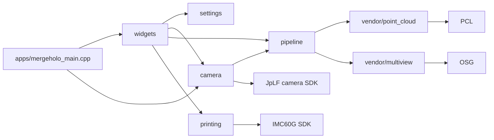

# Project Code Index Implementation Plan

> **For agentic workers:** REQUIRED SUB-SKILL: Use superpowers:subagent-driven-development (recommended) or superpowers:executing-plans to implement this plan task-by-task. Steps use checkbox (`- [ ]`) syntax for tracking.

**Goal:** Create a maintained-source architectural index and dependency map for MergeHolo at `docs/PROJECT_CODE_INDEX.md`.

**Architecture:** One Markdown document is the stable entry point. Its two Mermaid graphs describe build/runtime and module direction; module sections hold compact type cards with source path, role, direct project dependencies, callers, and state or data boundary. The qmake manifests define source ownership; project headers and implementations provide the dependency facts.

**Tech Stack:** Qt 5/qmake, C++17 source, PowerShell, Mermaid Markdown, ripgrep, Git.

## Global Constraints

- Index all maintained source under `apps`, `camera`, `pipeline`, `printing`, `settings`, `widgets`, `vendor/base`, `vendor/point_cloud`, and `vendor/multiview`.
- Treat Qt, OpenCV, PCL, OSG, CUDA, JpLF v4.1.1, and IMC60G as external boundaries, not internally indexed source.
- Do not index generated files under `00-bin`, `FF-tmp`, `build`, `debug`, `release`, `output`, `runs`, or test executable directories.
- Refer to project-owned types and files by their actual paths and names; do not infer dependencies from directory names alone.
- Retain current source architecture. This task documents it and makes no production-code changes.

---

### Task 1: Create the index structure and compile ownership baseline

**Files:**
- Create: `docs/PROJECT_CODE_INDEX.md`
- Read: `mergeholo.pro`
- Read: `pipeline/PipelineModule.pri`
- Read: `Pri/common.pri`, `Pri/holo_pipeline.pri`, `Pri/imc60g.pri`, `Pri/opencv.pri`, `Pri/cuda.pri`, `Pri/ffmpeg.pri`, `Pri/eigen5.pri`

**Interfaces:**
- Consumes: qmake `SOURCES`, `HEADERS`, `FORMS`, `INCLUDEPATH`, `LIBS`, and `DESTDIR` declarations.
- Produces: the document's scope, reading guide, build ownership table, directory-role table, and all module headings used by later tasks.

- [ ] **Step 1: Extract the compiled source inventory from qmake manifests**

Run:

```powershell
rg -n -C 120 '^(SOURCES|HEADERS|FORMS|include\()' mergeholo.pro pipeline/PipelineModule.pri
```

Expected: `mergeholo.pro` lists the application, camera, printing, settings, widgets, and maintained vendor files; `PipelineModule.pri` lists pipeline-owned files.

- [ ] **Step 2: Add the index header and build boundary**

Write these top-level headings, in this order:

```markdown
# MergeHolo Project Code Index
## How To Read And Maintain This Index
## Build Ownership And External Boundaries
## Runtime And Data Flow
## Module Dependency Map
## Directory And File Roles
## Application, UI, Settings, And Camera
## Pipeline
## Printing
## Maintained Vendor Modules
## External SDK And Library Boundaries
## Configuration, Scripts, And Tests
## Coverage Checklist
```

Under `Build Ownership And External Boundaries`, state that `mergeholo.pro` and `pipeline/PipelineModule.pri` are the authoritative compiled-source manifests, `Pri/common.pri` owns output/intermediate locations, and qmake `.pri` files own build-time external linkage.

- [ ] **Step 3: Verify the required document structure exists**

Run:

```powershell
rg -n '^## (How To Read And Maintain This Index|Build Ownership And External Boundaries|Runtime And Data Flow|Module Dependency Map|Directory And File Roles|Application, UI, Settings, And Camera|Pipeline|Printing|Maintained Vendor Modules|External SDK And Library Boundaries|Configuration, Scripts, And Tests|Coverage Checklist)$' docs/PROJECT_CODE_INDEX.md
```

Expected: 12 matches, one for every required index section.

- [ ] **Step 4: Commit the structural baseline**

```powershell
git -C C:\wzp\Holographicface add -- mergeholo/docs/PROJECT_CODE_INDEX.md
git -C C:\wzp\Holographicface commit -m "docs: add project code index structure"
```

Expected: the commit contains only `mergeholo/docs/PROJECT_CODE_INDEX.md`.

### Task 2: Index application, UI, settings, and camera ownership

**Files:**
- Modify: `docs/PROJECT_CODE_INDEX.md`
- Read: `apps/mergeholo_main.cpp`
- Read: `widgets/*.h`, `widgets/*.cpp`, `ui/*.ui`
- Read: `settings/*.h`, `settings/*.cpp`
- Read: `camera/CaptureOrientation.*`, `camera/CaptureSession.*`, `camera/FrameChangeDetector.hpp`, `camera/LightFieldCapture.*`, `camera/JpICamera.h`, `camera/JpIParse.h`
- Read: `camera/CommonFiles/**/*.h`, `camera/CommonFiles/**/*.hpp`

**Interfaces:**
- Consumes: the executable entry point, Qt widget ownership, unified settings storage, capture session types, and retained camera common headers.
- Produces: one type card for every maintained type and a clear UI-to-processing/capture dependency direction.

- [ ] **Step 1: Enumerate declared project types before describing them**

Run:

```powershell
rg -n --glob '*.{h,hpp,cpp}' '^\s*(class|struct|enum class|enum|using)\s+[A-Za-z_]' apps camera settings widgets
```

Expected: declarations covering `CaptureWindow`, all four settings dialogs, `ProcessingSettings`, `ProcessingSettingsStore`, `CaptureSessionOptions`, `LightFieldCapture`, `CaptureOrientation`, `FrameChangeDetector`, JpLF adapter declarations, and retained `camera/CommonFiles` types.

- [ ] **Step 2: Record the runtime entry and UI ownership chain**

Add cards for `main`, `CaptureWindow`, `InputSettingsDialog`, `ProcessingSettingsDialog`, `SaveSettingsDialog`, `Print9030Dialog`, `NativeUiStyle`, `KeyValueConfig`, `ProcessingSettings`, and `ProcessingSettingsStore`.

Each card must name its source file, direct project dependencies, primary caller, and state/data boundary. The `main` card must describe `--ui`, `--capture`, `--import-capture`, `--capture-and-run`, and pipeline pass-through dispatch.

- [ ] **Step 3: Record capture ownership and the camera SDK boundary**

Add cards for `CaptureSessionOptions`, `runCaptureSession`, `CaptureOrientation`, `LightFieldCapture`, `FrameChangeDetector`, `JpICamera`, `JpIParse`, and every maintained `camera/CommonFiles` type declaration.

For `JpICamera` and `JpIParse`, state that they are project-side declarations coupled to the JpLF v4.1.1 SDK. For `LightFieldCapture`, record the initialization, capture, parse, queue, and teardown boundaries.

- [ ] **Step 4: Verify application-owned source coverage**

Run:

```powershell
rg -n 'apps/mergeholo_main.cpp|widgets/CaptureWindow.h|settings/ProcessingSettingsStore.h|camera/LightFieldCapture.h|camera/CaptureSession.h|camera/CommonFiles/' docs/PROJECT_CODE_INDEX.md
```

Expected: at least one precise path reference for each application, UI, settings, and camera sub-area.

- [ ] **Step 5: Commit the application and camera index**

```powershell
git -C C:\wzp\Holographicface add -- mergeholo/docs/PROJECT_CODE_INDEX.md
git -C C:\wzp\Holographicface commit -m "docs: index application and camera modules"
```

Expected: the commit updates only the index document.

### Task 3: Index the processing pipeline and printing subsystem

**Files:**
- Modify: `docs/PROJECT_CODE_INDEX.md`
- Read: `pipeline/*.h`, `pipeline/*.cpp`, `pipeline/stages/*`, `pipeline/elemental/*`, `pipeline/multiview/*`
- Read: `printing/*.h`, `printing/*.cpp`
- Read: `config/default_pipeline.ini`, `config/ui_pipeline_template.ini`, `config/imc60g_print.ini`, `config/print_9030.ini`

**Interfaces:**
- Consumes: pipeline stage contracts, shared context/configuration/result structures, printing interfaces, and the active print hardware profile.
- Produces: the stage-to-stage processing graph and the print controller to IMC60G/SV660N hardware map.

- [ ] **Step 1: Extract direct includes and type declarations for pipeline and printing**

Run:

```powershell
rg -n --glob '*.{h,hpp,cpp}' '^(#include "|\s*(class|struct|enum class|enum|using)\s+[A-Za-z_])' pipeline printing
```

Expected: enough source-level evidence to map each project's direct include dependencies rather than relying on legacy documentation.

- [ ] **Step 2: Add pipeline stage and in-memory result cards**

Add cards for `HoloPipeline`, `PipelineConfig`, `PipelineContext`, `PipelineInput`, `PipelineTiming`, `PipelineLogger`, `CaptureImport`, `ExternalDepthOrientation`, `ResultPersistence`, `ResultSaveSettings`, `DepthMeshModelMemory`, every stage under `pipeline/stages`, every type under `pipeline/elemental`, and every type under `pipeline/multiview`.

Describe the current data path as `RGB + TIFF -> depth point cloud -> PCL mesh -> OSG geometry/multiview memory -> elemental memory -> persisted output`, and distinguish default in-memory processing from the disabled direct-atlas experiment.

- [ ] **Step 3: Add printing control, timing, rendering, and hardware cards**

Add cards for `PrintController`, `PrintJobRunner`, `PrintConfig`, `PrintFrame`, `PrintImageSource`, `PrintHardwareProfile`, `PrintHardwarePreflight`, `PrintPositionSampler`, `SecondScreenSelection`, `IPrintFramePresenter`, `IVBlankWaiter`, `IMotionController`, `IExposureController`, `IImc60gApi`, `Imc60gApi`, `Imc60gMotionController`, `Sv660nExposureController`, `V2PrintTiming`, `V2D3DFramePresenter`, and every retained legacy or DFJZH type.

Mark `Imc60gApi` as the only direct IMC60G SDK adapter, mark `Sv660nExposureController` as the exposure-control adapter, and identify obsolete-looking `Legacy*` cards as retained compatibility code rather than active default flow unless source callers prove otherwise.

- [ ] **Step 4: Verify core data and hardware flows are represented**

Run:

```powershell
rg -n 'HoloPipeline|DepthStage|MeshStage|MultiviewStage|ElementalStage|PrintController|PrintJobRunner|Imc60gApi|Sv660nExposureController' docs/PROJECT_CODE_INDEX.md
```

Expected: at least one type card and one dependency/data-flow reference for every named core type.

- [ ] **Step 5: Commit the pipeline and printing index**

```powershell
git -C C:\wzp\Holographicface add -- mergeholo/docs/PROJECT_CODE_INDEX.md
git -C C:\wzp\Holographicface commit -m "docs: index pipeline and printing modules"
```

Expected: the commit updates only the index document.

### Task 4: Index maintained vendor modules, draw graphs, and validate coverage

**Files:**
- Modify: `docs/PROJECT_CODE_INDEX.md`
- Read: `vendor/base/*`, `vendor/point_cloud/include/*`, `vendor/point_cloud/src/*`, `vendor/multiview/*`
- Read: `config/*`, `scripts/*.ps1`, `camera/tests/*`, `pipeline/tests/*`, `printing/tests/*`, `widgets/tests/*`, `vendor/point_cloud/tests/*`

**Interfaces:**
- Consumes: maintained vendor implementation, qmake build configuration, runtime configuration, and test-project ownership.
- Produces: vendor type cards, external dependency boundaries, two Mermaid graphs, and a checked coverage checklist.

- [ ] **Step 1: Index all maintained vendor types and free-function modules**

Run:

```powershell
rg -n --glob '*.{h,hpp,cpp}' '^\s*(class|struct|enum class|enum|using|[A-Za-z_][A-Za-z0-9_:<>]*\s+[A-Za-z_][A-Za-z0-9_]*\()' vendor/base vendor/point_cloud vendor/multiview
```

Expected: an inventory for `FileLibrary`, `Logger`, point-cloud conversion/texturing/Poisson functions, multiview render plan/atlas/batch/rendering types, camera-orbit structures, model movement, and in-memory sink types.

Add a compact card for every maintained vendor type or coherent free-function module, showing which pipeline stage or project adapter consumes it.

- [ ] **Step 2: Add the two dependency graphs**

Add this runtime graph, extending nodes only when direct source evidence requires it:



Add a separate module direction graph showing `settings -> widgets`, `camera -> widgets`, `pipeline -> widgets`, `printing -> widgets`, `vendor/base -> pipeline`, `vendor/point_cloud -> pipeline`, and `vendor/multiview -> pipeline` only where callers in source substantiate the arrow.

- [ ] **Step 3: Add configuration, script, test, and generated-output roles**

Index each `config/*.ini` and `.cfg` by its owning subsystem; list `scripts/build.ps1` and each test runner by purpose; record test qmake projects as verification entry points.

Under `Directory And File Roles`, label `00-bin`, `FF-tmp`, `build`, `debug`, `release`, `output`, `runs`, and `.qmake.stash` as generated/local state based on `.gitignore` and `README.md`, rather than project source.

- [ ] **Step 4: Run documentation completeness and path checks**

Run:

```powershell
rg --files apps camera pipeline printing settings widgets vendor/base vendor/point_cloud vendor/multiview -g '!**/tests/**' -g '!**/release/**' -g '!**/debug/**' | ForEach-Object { if (-not (Select-String -SimpleMatch $_ docs/PROJECT_CODE_INDEX.md -Quiet)) { $_ } }
```

Expected: no output for every non-generated maintained source file that has a meaningful role; explicit exceptions are limited to paired implementation files documented through their header and are listed in `Coverage Checklist`.

Run:

```powershell
git -C C:\wzp\Holographicface diff --check -- mergeholo/docs/PROJECT_CODE_INDEX.md
```

Expected: no output.

- [ ] **Step 5: Commit the completed index**

```powershell
git -C C:\wzp\Holographicface add -- mergeholo/docs/PROJECT_CODE_INDEX.md
git -C C:\wzp\Holographicface commit -m "docs: add MergeHolo code index"
```

Expected: the commit adds the complete code index and contains no generated output.
